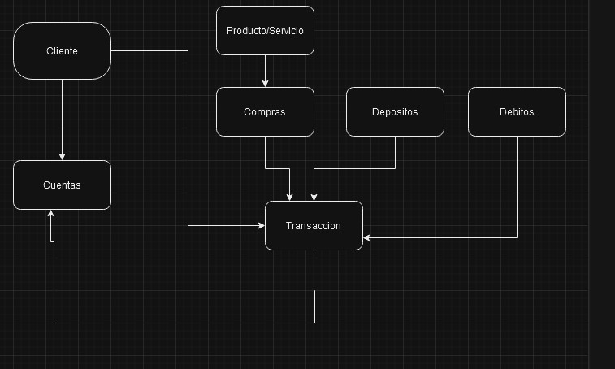
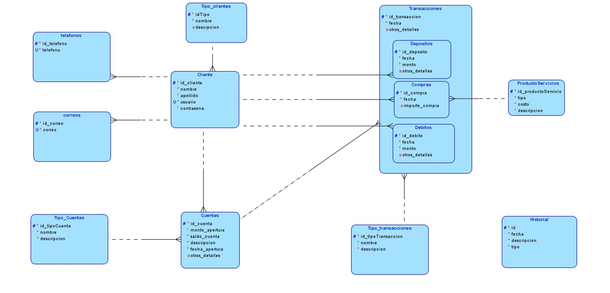
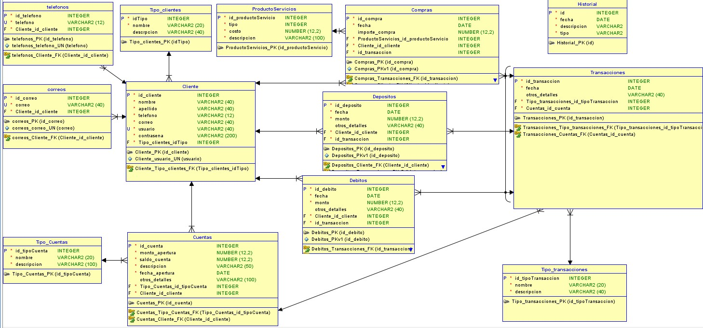

#### Universidad de San Carlos de Guatemala
#### Facultad de Ingeniería
#### Laboratorio Sistemas de Bases de Datos 1
#### Primer Semestre de 2024

|Nombre  | Carnet | 
|------------- | -------------|
|Jorge Sebastian Zamora Polanco  | 202002591|

# Manual Tecnico

## [Proyecto 2]([BD1]PROYECTO2_1S2024.pdf)
### Objetivos Generales

- Creacion de modelos de bases de datos relacionales.
- Manejo de Excepciones y Errores Personalizados.
- Creacion de Procedimientos almacenados.
- Normalización de base de datos.
- Creacion de triggers

### Modelos de la base de datos

- Modelo Conceptual

- Modelo Logico

- Modelo Fisico

### [Creacion modelo de la base de datos](./CrearModelo.sql)
El modelo de base de datos financiero diseñado consta de varias tablas relacionales 
que representan entidades clave en un sistema financiero, como clientes, cuentas, transacciones y tipos de transacciones.

#### Competencias Destacadas
- Diseño de Base de Datos Relacional
- Uso de Claves Primarias y Foráneas
- Tipos de Datos y Restricciones
- Creación de una tabla de historial para registrar cambios en la base de datos
- Normalización de Bases de Datos

### [Procedimientos Almacenados](./Procedures.sql)
Se presenta una serie de procedimientos almacenados diseñados para interactuar con una base de datos financiera. 
Estos procedimientos abordan diversas operaciones como el registro de clientes, tipos de cuentas, transacciones, compras, débitos y depósitos.

#### Competencias Destacadas
-Validación de Parámetros
-Validación de Datos
-Gestión de Errores
-Interacción con la Base de Datos

### [Triggers](./Triggers.sql)
Los siguientes triggers se han diseñado para garantizar la integridad de los datos y 
registrar cambios importantes en una base de datos financiera. 

#### Competencias Destacadas
- Mantenimiento de la Integridad de Datos
- Auditoría de Cambios
- Gestión de Eventos

### [Consultas](./Consultas.sql)
Los siguientes procedimientos almacenados se han creado para facilitar consultas específicas en una base de datos

#### Competencias Destacadas
- Desarrollo de consultas SQL avanzadas (SELECT, JOIN, INNER JOIN, GROUP BY, UNION, WHERE y CASE)
- Manejo de errores

